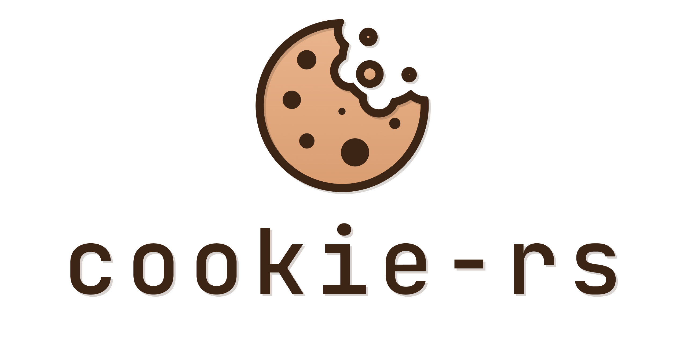

# Cookie Library

`cookie-rs` is a flexible library for working with HTTP cookies. It allows you to create, parse, and manage cookies.

## Features

- Create cookies with various attributes (e.g., `Domain`, `Path`, `Secure`, `HttpOnly`).
- Parse cookies from HTTP headers in lenient or strict mode.
- Manage cookies using `CookieJar`, which tracks additions and removals.
- Support for `SameSite` attribute.
- Automatic percent-encoding and decoding of cookie values (enabled by default).
- Errors are handled gracefully through `ParseError`.

## Quick Start

To use this library, add it to your dependencies:

```diff
[dependencies]
...
+ cookie-rs = "0.5.0"
```

### Create a Cookie

```rust
use cookie_rs::prelude::*;

let cookie = Cookie::builder("session", "abc123")
    .domain("example.com")
    .path("/")
    .secure(true)
    .http_only(true)
    .same_site(SameSite::Lax)
    .build();

println!("{}", cookie.to_string());
```

Output:

```text,ignore
session=abc123; Domain=example.com; HttpOnly; Path=/; SameSite=Lax; Secure
```

### Parse a Cookie

```rust
use cookie_rs::Cookie;

let cookie = Cookie::parse("session=abc123; Secure; HttpOnly").unwrap();
assert_eq!(cookie.name(), "session");
assert_eq!(cookie.value(), "abc123");
assert_eq!(cookie.secure(), Some(true));
assert_eq!(cookie.http_only(), Some(true));
```

### Percent-Encoding

Cookie values are automatically percent-encoded when serialized and decoded when parsed.
This behavior is enabled by default and can be disabled via Cargo features.

```rust
use cookie_rs::prelude::*;

let cookie = Cookie::new("data", "hello world");
assert_eq!(cookie.to_string(), "data=hello%20world");

let parsed = Cookie::parse("data=hello%20world").unwrap();
assert_eq!(parsed.value(), "hello world");
```

To disable encoding:

```toml
[dependencies]
cookie-rs = { version = "0.5.0", default-features = false }
```

### Manage Cookies with `CookieJar`

```rust
use cookie_rs::{Cookie, CookieJar};

let mut jar = CookieJar::default();

jar.add(Cookie::new("user", "john"));

if let Some(cookie) = jar.get("user") {
    println!("Found cookie: {}={}.", cookie.name(), cookie.value());
}

jar.remove("user");
assert!(jar.get("user").is_none());
```

### Parse a `Cookie` Request Header

`CookieJar::parse` accepts the `Cookie` request header format (`name=value` pairs separated by `; `).

```rust
use cookie_rs::CookieJar;

let jar = CookieJar::parse("name1=value1; name2=value2").unwrap();
assert!(jar.get("name1").is_some());
assert!(jar.get("name2").is_some());
```

### Generate `Set-Cookie` Response Headers

```rust
use cookie_rs::{Cookie, CookieJar};

let mut jar = CookieJar::default();
jar.add(Cookie::new("name1", "value1"));
jar.add(Cookie::new("name2", "value2"));

for header in jar.as_header_values() {
    println!("Set-Cookie: {}", header);
}
```

Output:

```text,ignore
Set-Cookie: name1=value1
Set-Cookie: name2=value2
```

### Owned Cookies

To detach a cookie from the lifetime of the source string use `into_owned`:

```rust
use cookie_rs::prelude::*;

fn parse_session(header: &str) -> Cookie<'static> {
    Cookie::parse(header).unwrap().into_owned()
}
```
